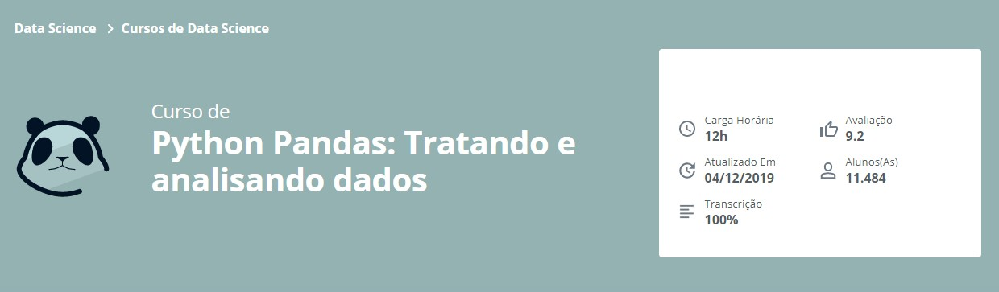

Repositório de desenvolvimento referente ao **Curso de Python Pandas: Tratando e analisando dados - Alura**

## Aprendido no curso
* Importar dados e exportar dataframes
* Limpando e tratar dados faltantes
* Remover outliers e criar novas variáveis
* Selecionar e gerar frequencias dos dados
* Usar Python Pandas, Matplotlib, Jupyter e Anaconda

## Link para o Curso 
https://cursos.alura.com.br/course/introducao-python-pandas
